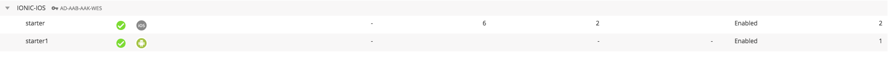

# appdynamics-hybrid-EUM-ionic

Edit `app.component.ts` and add
` 
...
import ...
declare var window: any;
....
`
and
`
...
platform.ready().then(() => {
...
window.plugins.ADEUMMobilePlugin.initWithConfiguration(
{
"appKey": "'<KEY>",
"collectorUrl": "https://col.eum-appdynamics.com",
"screenshotUrl": "https://image.eum-appdynamics.com",
"screenshots": true,
"loggingLevel": 4 
},
(success) => {
console.log("initWithConfiguration return: success");
},
(error) => {
console.log("initWithConfiguration error:" + error);
}
);
...
`

### ScreenShot AppDynamics EUM BRUN
